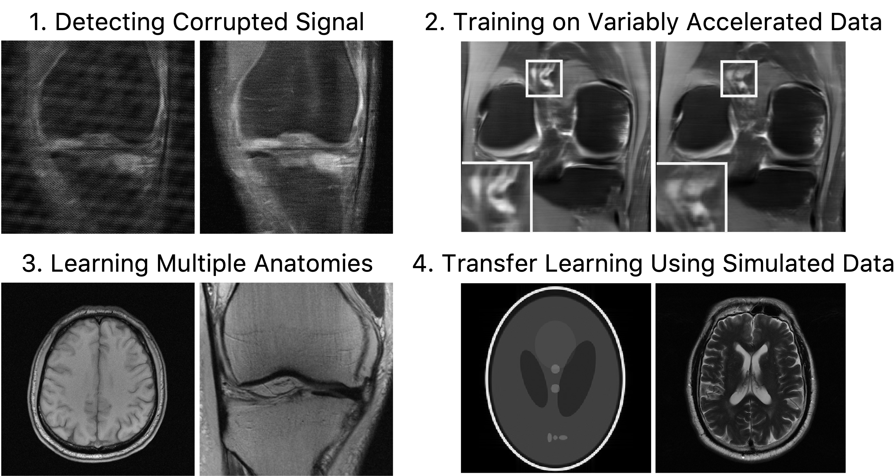

# A Path Towards Clinical Adaptation of Accelerated MRI

[](LICENSE.md)
[](https://www.microsoft.com/en-us/research/)
[](mailto:michael.yao@pennmedicine.upenn.edu)



Accelerated MRI reconstructs images of clinical anatomies from sparsely sampled signal data to reduce patient scan times. While recent works have leveraged deep learning to accomplish this task, such approaches have often only been explored in simulated environments where there is no signal corruption or resource limitations. In this work, we explore the following augmentations to neural network MRI image reconstructors to enhance their clinical relevancy. Namely,

  1. (**Detecting Signal Corruption**) We propose a neural network-based approach for detecting sources of image artifacts during signal preprocessing.
  2. (**Acceleration Factor Balancing**) We demonstrate that training reconstructors on MR signal data with variable acceleration factors can improve their average performance at any time step of a clinical patient scan.
  3. (**Learning Multiple Anatomies**) We offer a new loss function to overcome catastrophic forgetting when models learn to reconstruct MR images of multiple anatomies and orientations. 
  4. (**Phantom Pre-Training**) We propose a framework using simulated phantom data to leverage transfer learning for learning to reconstruct other anatomies with limited clinically acquired datasets and compute capabilities.

## Installation

To install and run our code, first clone the `accMRI` repository.

```
git clone https://github.com/michael-s-yao/accMRI
cd accMRI
```

Next, create a virtual environment and install the relevant dependencies.

```
python -m venv env
source env/bin/activate
pip install -r requirements.txt
```

Download and organize the fastMRI single- and multi- coil data from the [fastMRI website](https://fastmri.med.nyu.edu/). The datasets may be organized as follows:

```
└── data
    ├── knee       
        ├── knee_multicoil_train
        ├── knee_multicoil_val
        ├── knee_multicoil_test
        ├── knee_singlecoil_train
        ├── knee_singlecoil_val
        ├── knee_singlecoil_test
    ├── brain      
        ├── brain_multicoil_train
        ├── brain_multicoil_val
        ├── brain_multicoil_test
        ├── brain_singlecoil_train
        ├── brain_singlecoil_val
        ├── brain_singlecoil_test
```

## Organization

The [`disciminator`](./discriminator) directory contains our implementation for the *k*-space signal corruption detector, while the [`reconstructor`](./reconstructor) directory contains our implementation for our acceleration factor balancing, sequential learning, and transfer learning experiments. Generally speaking, `main.py` trains a model while `infer.py` allows you to run inference using a trained model. In training models using [`reconstructor/main.py`](./reconstructor/main.py), we highlight the following arguments:

  - (**Acceleration Factor Balancing**) In our implementation, a model will be trained on variably accelerated data by default. You can set a fixed acceleration factor(s) to use for training using the `--fixed_acceleration` argument.
  - (**Learning Multiple Anatomies**) In sequentially learning a subsequent reconstruction task, you can specify the EWC weighting parameter in the `--ewc` argument, and a path to the checkpoint file from the previous learning task in the `--ewc_state_dict` argument.
  - (**Phantom Pre-Training**) To pretrain a model using simulated phantom data, use the `--tl` flag and specify the number of coils to simulate using the `--num_coils` argument (default 15 coils). You can then finetune the pre-trained model by passing it in to the `--ckpt_path` argument in a subsequent run of `main.py`.

For additional details, please run `python main.py --help` (or `python infer.py --help`) within the relevant directory.

## Contact

Questions and comments are welcome. Suggestions can be submitted through Github issues. Contact information is linked below.

[Michael Yao](mailto:michael.yao@pennmedicine.upenn.edu)

[Michael Hansen](mailto:michael.hansen@microsoft.com) (*Corresponding Author*)

## Citation

    @InProceedings{pmlr-v193-yao22a,
      title={A Path Towards Clinical Adaptation of Accelerated {MRI}},
      author={Yao, Michael S. and Hansen, Michael S.},
      booktitle={Proceedings of the 2nd Machine Learning for Health symposium},
      pages={489-511},
      year={2022},
      volume={193},
      series={Proceedings of Machine Learning Research},
      publisher={PMLR},
      pdf={https://proceedings.mlr.press/v193/yao22a/yao22a.pdf},
      url={https://proceedings.mlr.press/v193/yao22a.html},
    }

## License

This repository is MIT licensed (see [LICENSE](LICENSE.md)). Portions of the code in this repository is adapted from the [fastMRI repository](https://github.com/facebookresearch/fastMRI) as part of a collaborative research project between Facebook AI Research (FAIR) and NYU Langone Health.
